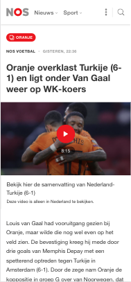
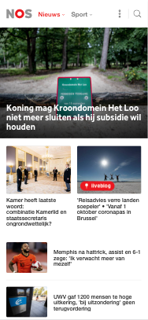
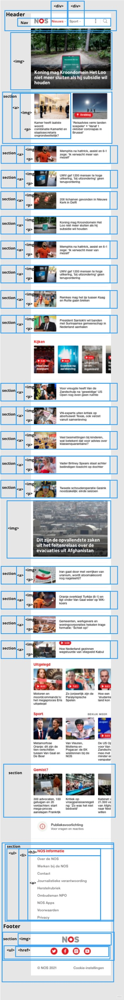
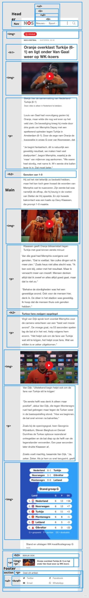

# Procesverslag
Markdown is een simpele manier om HTML te schrijven.  
Markdown cheat cheet: [Hulp bij het schrijven van Markdown](https://github.com/adam-p/markdown-here/wiki/Markdown-Cheatsheet).

Nb. De standaardstructuur en de spartaanse opmaak van de README.md zijn helemaal prima. Het gaat om de inhoud van je procesverslag. Besteedt de tijd voor pracht en praal aan je website.

Nb. Door *open* toe te voegen aan een *details* element kun je deze standaard open zetten. Fijn om dat steeds voor de relevante stuk(ken) te doen.

## Jij

uitwerken voor kick-off werkgroep

### Auteur:
Bilal Guenaoui

#### Je startniveau:
Blauw

#### Je focus:
Responsive
 

## Je website

uitwerken voor kick-off werkgroep

### Je opdracht:
https://nos.nl/
 
#### Screenshot(s) van de eerste pagina (small screen): 
Nos homepage

#### Screenshot(s) van de tweede pagina (small screen):
nose artikel  

 

## Breakdownschets (week 1)

uitwerken na afloop 2e werkgroep

### de hele pagina: 

### dynamisch deel (bijv menu): 

## Voortgang 1 (week 2)

uitwerken voor 1e voortgang

### Stand van zaken
Ik heb deze week alle afbeeldingen die ik wilde gebruiken al opgezocht en opgeslagen. Ook heb ik alvast de juiste pagina's aangemaakt zoals index.html en een artikel.html. Dit zijn allemaal voorbereidingne die ik heb getroffen zodat het werk later sneller en gemakkelijker gaat. Verder heb ik dit weekend nog wat extra geoefend met de javascript oefening omdat ik die nog een beetje ingewikkeld vind.
 
 

### Agenda voor meeting
samen met je groepje opstellen

| student 1      | student 2          | student 3    | student 4        |
| ---            | ---                | ---          | ---              |
| dit bespreken  | en dit             | en ik dit    | en dan ik dat    |
| en dat ook nog | dit als er tijd is | nog een punt | dit wil ik zeker |
| ...            | ...                | ...          | ...              |

### Verslag van meeting
hier na afloop snel de uitkomsten van de meeting vastleggen

- punt 1
- punt 2
- nog een punt
- ...

## Voortgang 2 (week 3)

uitwerken voor 2e voortgang

### Stand van zaken
 Deze week was ik erg veel aan het stoeien met de eerste onderdelen die op mijn NOS website komen. Zo wilde ik bijvoorbeeld wat afbeeldingen met kopjes naast elkaar krijgen me behulp van flexbox. Dit lukte mij telkens niet omdat ik de verkeerde parent aanriep in mijn CSS. ik heb dit probleem heb ik gevonden door mijn website te inspecteren.
 

### Agenda voor meeting
De vrgaen die ik wilde stellen waren

## Toegankelijkheidstest (week 4)

uitwerken na test in 8e voortgang

### Bevindingen
Lijst met je bevindingen die in de test naar voren kwamen:

 
### Parkinson
De website is is niet te gebruiken met de mouse-pad. Wel met de tap en enter toets.
 
### Brillen
de eerste bril die ik heb getest is een bril die alles een beetje wazig maakt. Als ik 1x inzoom is de website goed te lezen. 
 
Bij de gele bril is mijn website nog goed te gebruiken omdat de NOS website niet veel kleur heeft 

Bij de centraal field loss bril. Is de website ook goed te gebruiken als de gebruiker een beetje scrolt.
 
### Ballon
Als je met de ballon probeert hoog te houden kun je de website wel bedienen maar de artikelen niet echt goed lezen.
 
### Toetsenbord
mijn website is goed te gebruiken met een toetsenbord. 
 
### Screenreader
Mijn website wordt goed gelezen door 
In de header worden de dropdown elementen gelezen als “knop” terwijl de een dropdown menu is die veel meer opties biedt dan alleen een button.

De zoek loep wordt ook een knop genoemd terwijl ik wil dat die een zoekloep wordt genoemd.

ik weet niet hoe ik dit moet verbeteren
 
### Uitslag
Ik heb besloten om mijn navigatie linkjes in de header wat te vergroten omdat die nu niet zo goed te zien zijn voor mensen met een oog afwijking.

## Voortgang 3 (week 4)

uitwerken voor 3e voortgang

### Stand van zaken
Deze week heb ben ik erg ver gekomen met mijn website ik heb de hele header al af en werkend gekregen. Wel had ik nog wat problemen met de dropdownmenu's die 
linkten in mijnn css niet naar de juiste ul. Dit probleem heb ik uiteindelijk opgelost samen met de studentencoaches. ik moest de ul hebben die in de ul verstopt zat.

### Agenda voor meeting
Iets wat ik wil vragen voor deze week is of ik een wat beter inzicht kan krijgen hoe het eindgesprek er aan toe gaat.

 Mijn tweede vraag was hoe ziet het eindgesprek eruit volgende week?

### Verslag van meeting
Chelsey en ik waren de enige twee in de call wij hebben onze website's laten zien aan Rowin de studentcoach. Het was erg fijn om even samen met hem te bespreken waar wij waren en waar we een beetje zijn vastgelopen. Ik heb een korte uitleg gekregen over Media Query's die erg gewardeerd was.

Tot slot heb ik nog even het groepje van Sanne kunnen bijwonen om een vraagje te stellen over mijn slider die ik gemaakt heb. Namelijk of het erg was dat mijn slider niet zo erg lijkt op die van de NOS.nl.

## Eindgesprek (week 5)

uitwerken voor eindgesprek

### Stand van zaken
Deze week heb ik mij gefocus op mijn website geheel responsive te maken. Ik heb veel met Media Query's gewerkt wat ik heel fijn vond werken. Ook heb ik overal in mijn website waar ik kon de states geprobeerd te verwerken. Zo heb ik bijna alle H elementen een hover state gegeven. 

### Screenshot(s)

hier screenshot(s) van je eindresultaat

## Bronnenlijst

continu bijhouden terwijl je werkt

Nb. Wees specifiek ('css-tricks' als bron is bijv. niet specifiek genoeg).

1. bron 1
2. bron 2
3. ...

